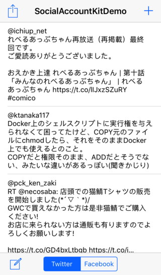

# SocialAccountKitSwift

iOS 11 以降使えなくなった、Account.framework と Social.framework の代替フレームワーク。
SocialAccountKitSwift.framework を使えば、iOS 10.3 までと同じ感じで Twitter や Facebook の API にアクセスできるよ。

設計コンセプトは、「できるだけ楽して対応」だ。
なので、接頭語の置き換えと若干の修正で対応できるように実装してみた。


## できること／できないこと

- [x] 複数の Twitter アカウントに対応
- [x] 複数の Facebook アカウントに対応
- [x] 公開されている API に直接アクセスが可能
- [x] **API Key** と **API Secret** を設定するだけの簡単導入
- [x] 少ない修正で Account.framework と Social.framework から移行可能
- [x] Twitter の [Application-only authentication](https://developer.twitter.com/en/docs/basics/authentication/overview/application-only) に対応 
- [x] [Google Firebase のユーザ認証](https://firebase.google.com/docs/auth/?authuser=0) で利用可能（Twitter や Facebook の公式 SDK が不要）

- [ ] 画像添付（開発者が API を直接アクセスするコードを実装すれば可能）
- [ ] Facebook のトークン再発行
- [ ] 十分なエラー処理


## 用意するもの

Twitter あるいは Facebook のサイトでアプリを登録し、API Key と API Secret を取得する必要がある。

### Twitter

1. [Twitter Application Management](https://apps.twitter.com/) ページにアクセスする。
2. **Create New App** を実行して、アプリケーションを登録する。
3. **Keys and Access Tokens** タブを選択し、 **Consumer Key** と **Consumer Secret** の文字列をコピーする。
4. Xcode Project 内の **Twitter.plist** の CosumerKey と ConsumerSecret にペーストする。

```Twitter.plist
<plist version="1.0">
<dict>
  <key>ConsumerKey</key>
  <string>YOUR CONSUMER KEY</string>
  <key>ConsumerSecret</key>
  <string>YOUR CONSUMER SECRET</string>
</dict>
</plist>
```

### Facebook

1. [開発者向け Facebook](https://developers.facebook.com/) ページにアクセスする。
2. 右上の **マイアプリ** から **新しいアプリを追加** を選択し、アプリを登録する。
3. ダッシュボード画面の **アプリID** と **app secret** の文字列をコピーする。
4. Xcode Project 内の **Facebook.plist** の AppID と AppSecret にペーストする。

```Facebook.plist
<plist version="1.0">
<dict>
  <key>AppID</key>
  <string>YOUR APP ID</string>
  <key>AppSecret</key>
  <string>YOUR APP SECRET</string>
  <key>Permissions</key>
  <array>
    <string>public_profile</string>
    <string>email</string>
    <string>user_posts</string>
    <string>user_friends</string>
  </array>
</dict>
</plist>
```

**Permissions** の値を調整したい場合は、[アクセス許可のリファレンス - Facebook ログイン](https://developers.facebook.com/docs/facebook-login/permissions) を参照してね。
Permission の値は認証後に変更できないので気を付けよう。
また、Facebook の承認が必要な値もあるので注意しよう。

さらにもう一手間、 OAuth 認証の設定をするよ。

1. プロダクト画面で **Facebook ログイン** を追加する。
2. **クライアントOAuth設定** 画面を開く。
3. **クライアントOAuthログイン** と **埋め込みブラウザOAuthログイン** を **はい** に変更する。


## SoicalAccountKitDemo の実行

Twitter.plist と Facebook.plist の設定が完了したら、実際にデモアプリを起動してみよう。

Xcode の Build Target を SocialAccountKitDemo に変更して Build を実行。


デモ画面の右上の **＋** でアカウントの登録と管理が可能。あとは、実際にアカウントを登録して、デモアプリを試してね。
アカウント登録が問題なく完了すれば、タイムラインを見たり、投稿したりできるよ。


## 自作アプリへの組み込み方法

### SocialAccountKitSwift.framework のビルド

Xcode の Build Target に SocialAccountKitXCFramework を指定して Build を実行すると、SocialAccountKitSwift.xcframework が作成される。これを自作アプリの Xcode の Embedded Binaries に設定する。良く使うなら、${HOME}/Library/Frameworks フォルダなどにコピーしておこう。

#### サクッと習得するには

1. SocialAccountKitDemo を動作可能にする。
2. SocialAccountKitDemo フォルダの RootViewController.swift のソースコードを表示する。
3. ソースコードを見ながら、デモを操作する。

これでコードによるアプリの動作と、実装したい機能のコードが見つかるはずだ。


### アカウント管理

iOS 11 よりも前は、iOS の設定アプリ内で Twitter や Facebook アカウントの管理ができた。
iOS 11 以降は設定項目が無くなったので、アプリ側で管理する必要がある。

SocialAccountKitSwift.framework では、SAKAccoutViewController クラスを提供する。
これを、次のようなソースコードを書いて呼び出す。

```Swift
  let accountType = SAKAccountType(.twitter)
  let viewController = SAKAccountViewController(accountType: accountType)
  present(viewController, animated: true, completion: nil)
```


### 管理アカウントへのアクセス

SAKAccountViewController を使って登録したアカウントは、次の方法でアクセスできる。
この例では、登録されている全ての Twitter アカウントを取得する。
accounts 配列にアカウント情報が保存されるので、UIAlertController などを使ってアカウントの選択機能を提供できる。


```Swift
  let store = SAKAccountStore.shared
  var accounts = [SAKAccount]()

  let accountType = SAKAccountType(.twitter)
  store.requestAccessToAccounts(with: accountType, completion: {
    [unowned self] (granted: Bool, error: Error?) in
    guard granted, error == nil else { return }
    if let accounts = self.store.accounts(with: self.accountType) {
      self.accounts = accounts
    }
  })
```


### 投稿

Twitter や Facebook に投稿する場合は、SAKComposeViewController クラスが利用可能だ。
直接、API にアクセスする方法もあるが、このクラスを利用した方が便利かも。

```Swift
  let accountType = SAKAccountType(.twitter)
  if SAKComposeViewController.isAvailable(for: accountType) {
    let viewController = SAKComposeViewController(for: accountType)
    viewController.completionHandler = {
      [unowned self] (result: SAKComposeViewControllerResult) -> Void in
      switch result {
        case .cancelled:
          print("cancelled")
        case .done(let json): // XXX: 'json' may be 'nil'.
          dump(json)
        case .error(let error):
          print(error.localizedDescription)
      }
    }
    present(viewController, animated: true, completion: nil)
  }
```


### Twitter / Facebook API へのアクセス

Twitter や Facebook の API にアクセスするには、以下のソースコードのように記述する。
これは、Twitter の Home Timeline を取得する実装例だ。
実際のソースコードはもっと長いので、SocialAccountKitDemo フォルダ内の RootViewController.swift の fetchHomeTimeline() を見てね。

```Swift
  let accountType = SAKAccountType(.twitter)
  if let requestURL = URL(string: "https://api.twitter.com/1.1/statuses/home_timeline.json") {
    let parameters: [String:Any] = [
      "count" : 20
    ]
    do {
      let request = try SAKRequest(forAccount: account, requestMethod: .GET, url: requestURL, parameters: parameters)
      request.perform(handler: {
        [unowned self] (data, response, error) in
        guard error == nil, let data = data else {
          dump(error)
          return
        }
        if let httpResponse = response as? HTTPURLResponse {
          if httpResponse.statusCode == 200 {
            let json = try? JSONSerialization.jsonObject(with: data, options: .allowFragments) as? [Dictionary<String,Any>]
            dump(json)
          }
          else {
            print("Status code is \(httpResponse.statusCode)")
          }
        }
      })
    }
    catch let error {
      print(error.localizedDescription)
    }
  }
```




## Google Firebase のユーザ認証での活用

Twitter や Facebook の公式 SDK を導入しなくても、次のようなソースコードで Firebase の Authentication のユーザ認証に利用できる。例は Facebook の場合。

```Swift:UIViewController
{
  let signInService = SAKSignInService(accountType: SAKAccountType(.facebook))

  @objc func handleSignIn(_ sender: UIButton) {
    signInService.signIn(contentController: self, completion: {
      (successful, account, error) in
      if successful, let token = account?.credential?.oauthToken {
        let credential = FacebookAuthProvider.credential(withAccessToken: token)
        Auth.auth().signIn(with: credential) {
          (user: User?, error: Error?) in
          if let error = error {
            print(error.localizedDescription)
            return
          }
          dump(user)
        }
      }
      else {
        dump(error)
      }
    })
  }
}
```

このとき、Facebook.plist に Firebase で指定された「 __OAuth リダイレクト URI__ 」を __CallbackURI__ キーで記述する。

```Facebook.plist
<plist version="1.0">
<dict>
  <key>AppID</key>
  <string>YOUR APP ID</string>
  <key>AppSecret</key>
  <string>YOUR APP SECRET</string>
  <key>CallbackURI</key>
  <string>YOUR FIREBASE REDIRECT URI</string>
</dict>
</plist>
```

Twitter の場合も同様である。


## クラス一覧

### SAKAccountType

#### Initializer
- init(\_ typeIdentifier: SAKServiceTypeIdentifier)

#### Methods
- func with(\_ block: @escaping (SAKServiceTypeIdentifier) -> Void)

#### Properties
- var accessGranted: Bool
- var description: String

```Swift
enum SAKServiceTypeIdentifier: Int32
{
  case twitter
  case facebook
  case instagram
}
```

### SAKAccount

#### Initializer
- init(accountType type: SAKAccountType, identifier: String)

#### Properties
- var username: String?
- var description: String
- var accountDescription: String
- var userFullName: String // Facebook only

### SAKAccountStore (Singleton)

#### Methods
- func account(withIdentifier identifier: String) -> SAKAccount?
- func accounts(with type: SAKAccountType) -> [SAKAccount]?
- func accountType(withAccountTypeIdentifier typeIdentifier: SAKServiceTypeIdentifier) -> SAKAccountType

- func saveAccount(\_ account: SAKAccount, withCompletionHandler handler: @escaping SAKAccountStoreSaveCompletionHandler)
- func removeAccount(\_ account: SAKAccount, withCompletionHandler handler: @escaping SAKAccountStoreRemoveCompletionHandler)
- func renewCredential(for account: SAKAccount, completion: @escaping SAKAccountStoreCredentialRenewalHandler)

- func requestAccessToAccounts(with accountType: SAKAccountType, options: Dictionary<String,String>? = nil, completion: @escaping SAKAccountStoreRequestAccessCompletionHandler)

#### Properties
- var accounts = [SAKAccount]() // readonly

#### Typealiases
- typealias SAKAccountStoreSaveCompletionHandler = (\_ success: Bool, \_ error: Error?) -> Void
- typealias SAKAccountStoreRemoveCompletionHandler = (\_ success: Bool, \_ error: Error?) -> Void
- typealias SAKAccountStoreRequestAccessCompletionHandler = (\_ granted: Bool, \_ error: Error?) -> Void
- typealias SAKAccountStoreCredentialRenewalHandler = (\_ result: SAKAccountCredentialRenewResult, \_ error: Error?) -> Void

```Swift
enum SAKAccountCredentialRenewResult
{
  case renewed
  case rejected
  case failed
}
```

### SAKComposeViewController

- class func isAvailable(for accountType: SAKAccountType) -> Bool

#### Initializer
- init(for accountType: SAKAccountType)

#### Properties
- var completionHandler: SAKComposeViewControllerCompletionHandler

#### Typealias
- typealias SAKComposeViewControllerCompletionHandler = (SAKComposeViewControllerResult) -> Void

```Swift
enum SAKComposeViewControllerResult
{
  case cancelled
  case done([String:Any]?)
  case error(Error)
}
```

### SAKRequest

#### Initializer
- init(forAccount account: SAKAccount, requestMethod method: SAKRequestMethod, url: URL, parameters: [String:Any] = [:]) throws

#### Methods
- func perform(handler: @escaping SAKRequestHandler)

#### Properties
- var account: SAKAccount? // readonly
- var method: SAKRequestMethod // readonly
- var URL: URL? // readonly
- var parameters: [String:Any] // readonly

#### Typealias
- typealias SAKRequestHandler = (Data?, URLResponse?, Error?) -> Void

```Swift
enum SAKRequestMethod: String
{
  case GET    = "GET"
  case POST   = "POST"
  case DELETE = "DELETE"
  case PUT    = "PUT"
}
```


## References

Qiita の [SocialAccountKit を使った iOS 11 以降の Twitter と Facebook API へのアクセス](https://qiita.com/magickworx/items/49ca167802e3c65ad5a9) も見てね。


## Requirements

 - Swift 5
 - iOS 14.3 or later
 - Xcode 12.3 or later

## ToDo

 - Facebook のアクセストークンの有効期限切れ時の処理

## License Agreement

Copyright (c) 2017-2021, Kouichi ABE (WALL) All rights reserved.

Redistribution and use in source and binary forms, with or without
modification, are permitted provided that the following conditions are met:

 1. Redistributions of source code must retain the above copyright notice,
    this list of conditions and the following disclaimer.

 2. Redistributions in binary form must reproduce the above copyright notice,
    this list of conditions and the following disclaimer in the documentation
    and/or other materials provided with the distribution.

THIS SOFTWARE IS PROVIDED BY THE COPYRIGHT HOLDERS AND CONTRIBUTORS "AS IS"
AND ANY EXPRESS OR IMPLIED WARRANTIES, INCLUDING, BUT NOT LIMITED TO, THE
IMPLIED WARRANTIES OF MERCHANTABILITY AND FITNESS FOR A PARTICULAR PURPOSE ARE
DISCLAIMED. IN NO EVENT SHALL THE COPYRIGHT HOLDER OR CONTRIBUTORS BE LIABLE
FOR ANY DIRECT, INDIRECT, INCIDENTAL, SPECIAL, EXEMPLARY, OR CONSEQUENTIAL
DAMAGES (INCLUDING, BUT NOT LIMITED TO, PROCUREMENT OF SUBSTITUTE GOODS OR
SERVICES; LOSS OF USE, DATA, OR PROFITS; OR BUSINESS INTERRUPTION) HOWEVER
CAUSED AND ON ANY THEORY OF LIABILITY, WHETHER IN CONTRACT, STRICT LIABILITY,
OR TORT (INCLUDING NEGLIGENCE OR OTHERWISE) ARISING IN ANY WAY OUT OF THE USE
OF THIS SOFTWARE, EVEN IF ADVISED OF THE POSSIBILITY OF SUCH DAMAGE.

